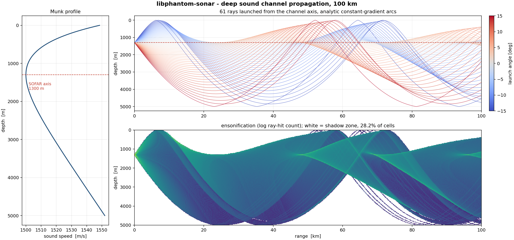
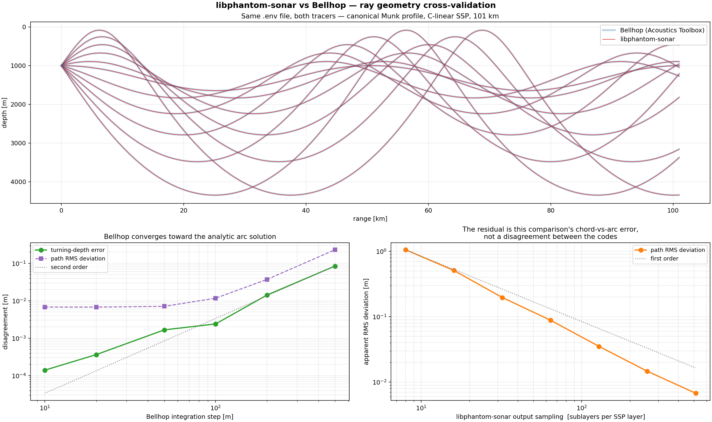

# libphantom-sonar

**Real-time ocean acoustics and sonar countermeasure *simulation* library.**
Zero dependencies, zero heap allocation, C++20.

[](LICENSE)




*61 rays through the canonical Munk deep sound channel, 100 km. Left: the sound
speed profile and its SOFAR axis. Top: ray paths as exact circular arcs. Bottom:
ensonification, with shadow zones in white. Reproduce with
`./build/munk_simulation data && python3 tools/plot_rays.py data`.*

---

## What this is

A library for modelling how sound actually travels through the ocean, built to
run in a real-time control loop on hardware that has no operating system and no
allocator.

**v0.1 ships the ocean model and the ray tracer**, cross-validated against
Bellhop. Echo synthesis and covert communication are designed but not implemented — see [the roadmap](docs/roadmap.md).
The repository states what is verified, what is only self-consistent, and what
is not verified at all, in [`docs/validation.md`](docs/validation.md).

It is a simulation and analysis library. It is not deployable countermeasure
firmware, and it models no specific platform. See [`EXPORT_NOTICE.md`](EXPORT_NOTICE.md).

## Why it might interest you

**The ray tracer is analytic, not stepped.** The sound speed profile is stored as
piecewise *linear* in depth, and inside a constant-gradient layer an acoustic ray
is exactly a circular arc. So each layer crossing is one closed-form step with no
integration error and no step size to tune:

```
ξ  = cos θ / c              Snell invariant, constant along the ray
R  = 1 / (ξ |g|)            arc radius,  g = dc/dz
Δr = (sin θ₁ − sin θ₂) / (ξ g)
Δt = ln[ c₂(1 + sin θ₁) / (c₁(1 + sin θ₂)) ] / g
```

That choice is measurable, not aesthetic. Resampling a linear profile from 2
points to 1001 points — the same ocean, described 500× more finely — moves the
answer by **4.6e-12 m over 40 km**. A stepping tracer moves by metres. Full
derivation in [`docs/math_spec.md`](docs/math_spec.md).

**Three sound speed equations, because the usual one is mislabelled.** The
six-term polynomial widely circulated as "the UNESCO equation" is actually
Medwin's simplification, valid only to 1000 m — which is *at or above the deep
sound channel axis*, making it the wrong tool for exactly the problem people
reach for it to solve. This library implements Medwin, Mackenzie (the default,
valid to 8000 m) and Chen & Millero (the real UNESCO algorithm, which takes
pressure rather than depth), and cross-validates them against each other in the
test suite.

**Cross-validated against Bellhop.** The reference ray code of the Acoustics
Toolbox, run on the same `.env` file — `phantom_trace` parses Bellhop's own input
format, so a transcription bug cannot masquerade as agreement.



The clean measurement is the **turning depth**: one number per ray, needing no
interpolation, solved for exactly here and approached by Bellhop as its
integrator step shrinks.

| Bellhop step | turning-depth error |
|---|---|
| 500 m | 0.084 m |
| 100 m | 0.0024 m |
| **10 m** | **0.00014 m** |

**0.14 mm over a 101 km path.** The direction is the point: Bellhop converges
*toward* this library's answer, which is what should happen if the analytic arc
solution is the exact limit a stepping integrator approaches.

Full-path RMS deviation is 0.27 m for trapped rays and 0.64 m with surface and
bottom bounces, at Bellhop's default step — but those numbers are a **ceiling,
not a measurement**, and [`docs/validation.md §2`](docs/validation.md) shows why:
the residual halves every time this library's *output sampling* is doubled, so it
is the comparison's chord-versus-arc error rather than a disagreement between the
codes.

**A ping analyser, because an echo synthesiser with no input is not a module.**
Detecting and characterising the incoming ping is the harder half of a
countermeasure, and the half with the latency budget — so it shipped first. A
bank of matched filters (CW / LFM / HFM), CA-CFAR detection, and a Pulse
Descriptor Word per arrival: time, type, centre frequency, bandwidth, chirp
rate, amplitude, SNR.

```
Filter bank
  [0] CW         12000 -  12000 Hz,  20.0 ms, TB =      0
  [1] LFM-up      8000 -  20000 Hz,  20.0 ms, TB =    240
  ...
Detections
  ToA (s)    type           amp    SNR dB    fc (Hz)   BW (Hz)
  0.20000    LFM-up       0.977      29.5      14000     12000   <- ToA error +1.3 us
  0.54998    CW           0.595      26.3      12000         0   <- ToA error -15.5 us
  0.95000    HFM          0.326      19.0      14000     12000   <- ToA error +3.9 us
```

The arrival-time estimator is checked against the **Cramér-Rao bound** — not
against another implementation, but against the best variance any unbiased
estimator could achieve. It sits at **0.93–1.02× the bound across 20 dB of SNR**.

Getting that comparison right required care: a magnitude detector is bounded by
the RMS bandwidth about the centre frequency, not by `f_rms` about zero. For an
8-20 kHz sweep those differ by 4.16×, so checking an envelope detector against
the coherent bound would make an efficient estimator look four times worse than
it is. Both are computed; [`docs/validation.md §4`](docs/validation.md) shows
which applies and why.

**Underwater Doppler is a time scaling, not a frequency shift.** With `c ≈ 1500
m/s`, `v/c` is ~500× larger than for an airborne radar at the same speed, and
that changes the engineering. Measured peak loss over a 60 ms 8-20 kHz sweep:

| closing speed | CW | LFM | HFM |
|---|---|---|---|
| 5 m/s | — | −5.7 dB | **−0.05 dB** |
| 15 m/s | — | −9.9 dB | **−0.14 dB** |
| 30 m/s | — | −13.1 dB | **−0.30 dB** |

which is why HFM dominates underwater: a time-scaled HFM is a *delayed* HFM.

It also breaks the textbook LFM range-Doppler formula. The narrowband result
uses the sweep's centre frequency; the wideband one uses its **end**:

```
dt = -(v/c) · f_end / mu
```

Verified on upsweeps, downsweeps and narrow sweeps — the narrowband formula is
off by 13 samples on the 8-16 kHz case where the wideband form agrees within 3.
Derivation in [`docs/math_spec.md §6.2`](docs/math_spec.md).

**A filter that lies about its covariance still tracks.** It just gates correct
measurements out, or accepts clutter, and nothing in its output says so. The
normalised innovation squared is chi-square with 2 degrees of freedom when the
filter is right, so that is what gets checked:

| statistic | measured | expected |
|---|---|---|
| mean NIS over 1980 samples | **1.951** | 2.000 |
| under the 95% gate | **95.0%** | 95% |
| under the 99% gate | **99.0%** | 99% |

Position error falls from 50.97 m raw to **20.89 m** filtered, and velocity —
which a single detection cannot know at all — comes out at (4.17, −7.18) against
a truth of (4.00, −7.00).

**And a roadmap claim, corrected in public.** v0.8's roadmap said tracking would
finally suppress the cross-template ghosts that have been a documented
limitation since v0.2. **It does not.** A ghost arrives whenever the real
detection does, at a fixed offset, so it is exactly as consistent over time as
the target and forms its own perfectly healthy track:

```
494 false alarms over 300 scans  ->  0 confirmed tracks
one target + its ghost           ->  2 confirmed tracks
```

Tracking kills false alarms, which do not repeat. Ghosts repeat. The test suite
asserts the honest outcome so the correction cannot quietly rot. v0.10 kills the
ghosts by a different mechanism — see below.

## v0.10 — fusing what was already measured

Four quantities were being produced by one subsystem and thrown away at the
boundary of the next. No new physics; just joining them up.

**A ghost is recognised by its origin, not its behaviour.** It is the same
arrival seen through a different matched filter: shared bearing, fixed range
offset, weaker, and a **different waveform label**. That last field is the whole
safety argument, and the test that proves it changes *only* that field:

```
line-astern formation, same waveform  ->  2 tracks (kept)
same geometry, different waveforms    ->  1 track  (suppressed)
```

Two real targets lit by one sonar return the same waveform. Without the label
check the formation is silently deleted — and deleting a real target is a far
worse failure than carrying a ghost.

**The Doppler bank's closing rate now reaches the filter**, with the chi-square
gate following the measurement dimension. What it is worth, including where it
stops being worth anything:

| scans | position only | with range rate | ratio |
|---|---|---|---|
| 3 | 4.213 m/s | **1.220 m/s** | 3.45× |
| 6 | 2.069 m/s | **0.649 m/s** | 3.19× |
| 20 | 0.365 m/s | 0.368 m/s | 0.99× |

The gain vanishes by twenty scans, because by then the filter's own estimate
already beats the measurement. That row is in the table rather than cropped out
of it. Related trap, also tested: a Doppler bank that fails to resolve a shift
reports 0 m/s, which is **not** a measurement that the target is stationary —
treating it as one reads a true 8.00 m/s closure as 5.686.

**Crossing targets keep their identities.** Association still gates on NIS, but
assigns over a global cost ordering instead of measurement arrival order:

```
before crossing: left=1 right=2
after  crossing: left=2 right=1
```

**MVDR survives coherent multipath** — one arrival by two paths, which is
exactly what this library's own ray tracer produces. Forward-backward spatial
smoothing turns 4 spurious peaks into 2 correct ones at ±6°. The cost is
aperture: resolution falls from 7.16° to 11.46°, and a test asserts that it
does.

**A 12 kHz chirp, steered 37× beyond where phase steering dies.** v0.7 measured
the limit and this release fixes it: a phase shift that is wrong across a band
is exactly right *within* one bin, so steer bin by bin.

```
phase-steering limit at 35 deg : 325 Hz
signal bandwidth               : 12000 Hz  -- 37x over
beam energy on target          : 23.80 dB
best off-target beam           :  6.79 dB
matched filter peak            : lag 400, pulse placed at 400
```

That last line is the one that matters — a phase-steered beam would smear the
chirp and move its peak.

**The check that earned its place immediately.** A narrowband tone pushed
through the *wideband* path must reproduce the closed-form array factor, and it
does to 5e-3. The first version of the test harness delayed the `+x` element
instead of advancing it, and every beam steered to the mirror bearing — which
looks like a working beamformer until you check where it points. An energy
contrast test said only "the contrast is poor"; this one said "the pattern is
mirrored".

**MVDR resolves what the aperture cannot.** Conventional beamforming cannot
separate two sources closer than one null-to-peak spacing *whatever the SNR* —
resolution is set by the aperture and nothing else. MVDR places nulls instead:

| | conventional limit 7.16°, sources 4.30° apart |
|---|---|
| conventional `aᴴRa` | **1 peak** |
| MVDR `1/aᴴR⁻¹a` | **2 peaks**, at ±2.145° against ±2.149° truth |

Solved by complex Cholesky rather than an explicit inverse. Diagonal loading is
verified as *necessary*: a rank-1 covariance over 16 elements fails the
factorisation outright, and the library reports that rather than returning noise
shaped like a spectrum.

**And the PDW finally has a direction.** The analyser run per beam: a source at
−22° peaks in the −20° beam of a 5° scan, at 38 dB.

**Bearing comes from phase across the aperture, not from which beam lit up.**
The Cramér-Rao bound for a line array is the spatial twin of v0.2's
arrival-time bound — the element index takes the place of time, and
`Σn'² = N(N²−1)/12` about the array centre takes the place of the waveform's
mean-square bandwidth:

```
var(θ) ≥ 6 / (ρ · (k d cos θ)² · N(N²−1))
```

Two things fall straight out of it. Accuracy improves as **N^(−3/2)**, not
N^(−1/2), because elements buy signal *and* aperture — doubling N gains
2^1.5 = 2.828, measured 2.845 / 2.833 / 2.830. And it degrades as **1/cos θ**,
because a target at endfire sees no projected aperture at all.

A 32-element half-wave array is bounded at **0.247° against a 3.17° beamwidth**
— one thirteenth of a beam. Conventional beamforming with parabolic peak
refinement measures **1.13 / 1.02 / 0.99 ×** that bound across 14 dB of SNR.

| N | CRLB | ratio to N/2 |
|---|---|---|
| 16 | 0.69939° | 2.8452 |
| 32 | 0.24691° | 2.8326 |
| 64 | 0.08726° | 2.8295 |

**The beam pattern is pinned by its closed forms**, because one that is subtly
wrong still looks like a beam: unity at the steer angle, nulls at
`sin θ − sin θ₀ = mλ/(Nd)`, and a first sidelobe converging to the **−13.26 dB**
signature of uniform shading (−12.797 at N=8, −13.260 at N=128).

**And the array joins up with the reverberation result.** Ten times the elements
is a tenth of the beamwidth is **exactly 10.00 dB** of echo-to-reverberation
ratio — the same 10 dB per decade of ensonified area. It also buys 10.0 dB of
array gain against isotropic noise. Two independent mechanisms agreeing is a
stronger check than either alone.

**One limit is stated rather than hidden.** Phase steering holds only while the
signal stays correlated across the array's traversal time: 249 Hz of usable
bandwidth at 15°, **91 Hz at 45°**. The library's own waveforms are 12 kHz
chirps, so a phase-steered array cannot handle them off broadside.
`narrowband_bandwidth_limit_hz` returns that number instead of the beamformer
quietly smearing.

**Against reverberation, a bigger transmitter buys nothing.** Write the echo and
the reverberation with the same source level and the same two-way loss:

```
EL      = SL − 2·TL + TS
RL      = SL − 2·TL + S_s + 10 log₁₀(A)
EL − RL = TS − S_s − 10 log₁₀(A)
```

`SL` and `TL` **cancel exactly**. Verified over nine combinations of source
level (160–240 dB) and transmission loss (40–90 dB): the ratio does not move by
a thousandth of a dB. Doubling the transmit power raises the target and the
background together.

What *does* help is shrinking the ensonified area `A` — a tenth of the pulse
length or a tenth of the beamwidth, each worth exactly +10 dB. And a chirp's
effective pulse length is `1/B`, not its duration, so compressing a 20 ms pulse
to its 83 µs resolution is worth **+23.8 dB**. That is the design argument for
pulse compression, and it is why the analyser's waveforms are chirps rather than
tones.

**Two decay laws tell you which mechanism you are looking at.** Boundary
reverberation falls as 30 log₁₀(r) — two-way spreading costs 40, the growing
annulus gives back 10. Volume reverberation falls as 20, because the shell grows
as r². Both reproduced exactly across three decades of range.

**And it is why CFAR exists.** Reverberation decays tens of dB across a single
processing block, so no fixed threshold is right anywhere:

```
background falls 21.6 dB across the block
CA-CFAR: 20/20 detections, 3 false alarms in 20 empty blocks
a single threshold at the block mean sits 9.5 dB below the near field
  and 12.2 dB above the far field
```

**Boundaries cost what they cost.** Bottom reflection is the Rayleigh
fluid-fluid coefficient, pinned by three independent closed-form limits — the
critical angle from the speed ratio, the impedance ratio at normal incidence,
and unity below critical for a lossless bottom. The critical angle,

```
θ_c = arccos(c_water / c_sediment)     — 24.62° for medium sand
```

is the number that decides which paths survive to long range in shallow water.
Sediment attenuation enters as a complex speed, so `|R| < 1` at *every* angle:
without it, sub-critical rays are trapped forever and shallow-water range is
unbounded, which is not what the ocean does.

The complex square root has two branches and only one is physical. Rather than
reason about sign conventions, the implementation takes the branch that
conserves energy — a 9100-combination sweep over speed, density, attenuation and
angle gives `max |R| = 1.000000000000`.

What that does to a 200 m duct at 3 km, 5 kHz, 8 m/s wind, sand bottom:

| surface | bottom | grazing | TL before | TL now |
|---|---|---|---|---|
| 0 | 0 | — | 71.80 | **71.80** |
| 1 | 1 | 6.83° | 70.67 | 82.85 |
| 2 | 2 | 13.93° | 70.95 | 132.73 |
| 4 | 3 | 24.69° | 71.62 | **199.51** |

Paths that all sat within 1 dB of each other now span 128 dB. The direct path is
unchanged, as it must be.

**Surface loss is capped, and the cap is the honest part.** At 0.5 m seas,
10 kHz and 20° grazing the coherent-scattering formula gives a **700 dB** loss.
That is arithmetic, not physics: the scattered energy goes into a diffuse field
a ray model does not carry, so the path is not 700 dB down — its *specular* part
is. The library reports a capped 30 dB and says why, rather than deleting a path
that is still in the water.

**Eigenrays, and spreading loss that reduces exactly to the closed form.** An
eigenray is a launch angle that reaches a given receiver. The search is exact
rather than interpolated: the tracer already stops on a range budget to machine
precision, so setting that budget to the receiver range makes the ray's final
point *the arrival*.

Geometric spreading then comes from the ray tube — the derivative of arrival
depth with respect to launch angle:

```
TL = -10 log10[ c_rcv cos(θ₀) / (c_src · r · cos(θ_rcv) · |dz/dθ₀|) ]
```

In isovelocity water that must reduce to `20 log10(R)`. It does, to **0.0000 dB**
across nine geometries from 1 to 20 km — with the Jacobian obtained by finite
difference *through the tracer*, so the agreement exercises the search, the
arc-length accumulator and the formula at once.

| range | offset | ray-tube TL | 20 log10(R) | difference |
|---|---|---|---|---|
| 1 km | 500 m | 60.9691 | 60.9691 | 0.0000 |
| 5 km | 2500 m | 74.9485 | 74.9485 | 0.0000 |
| 20 km | 3000 m | 86.1172 | 86.1172 | 0.0000 |

**Multipath the ocean chooses, not the caller.** Feed the eigenrays to the echo
synthesiser and the reply carries the arrival structure of the water it is
transmitted into:

```
Multipath from the ray tracer
      launch     t (ms)      srf      btm    TL (dB)
     -6.498d   1656.190        1        0      77.93
     -5.436d   1655.550        0        0      73.56
      8.952d   1690.677        0        1      72.00
  -> 3 echoes spanning 70.25 ms two-way
```

**Caustics are flagged, not answered.** Where neighbouring rays cross, the tube
collapses and ray theory predicts infinite intensity. That is a failure of the
method, not a property of the ocean, so the library refuses to report a level
rather than returning a number that looks like one.

**Doppler is where underwater differs from radar, and the bank sizing shows it.**
A zero-Doppler template detects a moving target but does not match it. How many
Doppler bins a bank needs is a property of the waveform — derived per family and
checked against measurement. Over ±20 m/s at 1 dB straddling loss, for the same
8-20 kHz 20 ms sweep:

| waveform | bins needed |
|---|---|
| CW | 14 |
| LFM | 5 |
| **HFM** | **2** |

Each bin is another correlation per block and another 128 kB of replica
spectrum, so that ratio is the design argument for hyperbolic sweeps stated as a
cost.

**Echo synthesis, verified by closed loop.** A ping is detected, an echo is
synthesised from the resulting descriptor, and the echo is fed back through the
analyser. A shared sign error between the two halves then shows up as a round
trip that does not close, instead of as two tests that agree and are both wrong.

```
Reply
   range (m)    TS (dB)    v (m/s) delay (ms)
           8         -2          3      10.62
          20         -5          0      26.55
          32         -8         -4      42.48
          44        -11          6      58.40

As received back
      ToA (ms) type            amp    SNR dB    v (m/s)
        12.659 LFM-up        0.525      21.0        4.0   <- ghost at 8 m
        44.472 LFM-up        0.258      17.1      -12.0   <- ghost at 32 m
        60.477 LFM-up        0.227      16.7       12.0   <- ghost at 44 m
```

Delay and Doppler are both **two-way**: `dt = 2dr/c` and
`alpha = (c+v)/(c-v)`, the exact form rather than `1 + 2v/c` (they differ by
0.4% at 30 m/s, which is four samples across a 20 ms pulse). The factor of two
in each is the likeliest bug in an echo path, so the round trip asserts the
reading is closer to the two-way scale than to the ghost's own velocity.

**The two halves cross-check each other.** In the closed-loop example an 8 m/s
ping lands in the 12 m/s bin; the 4 m/s residual produces an arrival-time error
of **+0.0885 ms**, and the wideband coupling formula predicts
`dt = -(v/c)·f_end/mu = +0.0885 ms`. Two results derived independently, agreeing
to four decimals.

**On cancelling the echo rather than faking it.** Every countermeasure
specification asks for anti-phase cancellation. This library quantifies it
instead of implementing it:

| cancellation | timing budget | path budget at 1500 m/s |
|---|---|---|
| −10 dB | 4.2 µs | 6.3 mm |
| −20 dB | 1.3 µs | **2.0 mm** |

Bandwidth barely matters (widening a 12 kHz-centred band from 0 to 12 kHz costs
0.3 dB); timing is everything. Past a quarter period the canceller *adds* up to
6 dB. Add distributed hull scattering — one projector cannot match phase at more
than one bearing — and the conclusion is that **generating false targets is the
achievable countermeasure; cancelling the real one is not.**

**Verified against closed forms, not against baselines.** A recorded baseline
tells you the code did not change. These tell you it is right:

| Property | Result |
|---|---|
| Snell invariant over 29 rays × 100 km | 1.7e-16 relative drift |
| Ray path vs analytic circle, 200 layer crossings | 1.9e-16 relative radial error |
| Turning depth vs `c(z) = c₀/cos θ₀` | < 1e-6 m |
| Range and travel-time budgets | exact to 1e-8 m / 1e-12 s |
| Mackenzie vs Chen-Millero, common validity box | 0.53 m/s max disagreement |
| Ray-tube spreading vs 20 log10(R), 9 geometries | 0.0000 dB |
| Thorp absorption vs the published formula | within 10% (what the fit is worth) |
| Rayleigh \|R\| ≤ 1 over 9100 sediment/angle combinations | max 1.000000000000 |
| Critical angle, normal incidence, sub-critical unity | exact to 1e-10 |
| Reverberation decay: 30 log r boundary, 20 log r volume | exact |
| Source level cancelling from E/R, 9 SL×TL combinations | identical to 1e-4 dB |
| Array first sidelobe vs the −13.26 dB uniform-shading limit | −13.260 at N=128 |
| Bearing estimator vs its Cramér-Rao bound | 0.99–1.13× across 14 dB |
| Wideband beam vs the closed-form array factor | 5e-3 worst |
| Shading sidelobes vs published window values | −13.3 / −31.5 / −42.7 / −58.1 dB |
| Tracker NIS vs its chi-square distribution | mean 1.951 vs 2, gates 95.0/99.0% |
| Fused 3-dof NIS vs its chi-square distribution | mean 2.998 vs 3, gates 94.7/98.9% |
| 3-dof gate quantiles, bisected vs published | 7.815 / 11.345 |
| Smoothed MVDR bearings on coherent sources | −6.00° / +6.00° (truth ±6) |
| FFT vs a direct O(N²) DFT sharing no code | 2.3e-16 relative |
| FFT correlation vs direct O(N·L) correlation | 1.1e-15 relative |
| Matched filter peak, width, coherent gain | `A·E/2`, `1/B`, `L/2` — all matched |
| Waveform classification, 4 types at −4.4 dB SNR | 100/100 |
| Chen-Millero vs the published UNESCO check value | 1731.9954 vs 1731.995 |
| Chen-Millero vs 220 published table values | 0.0499 m/s worst (table rounds to 0.05) |
| Ray turning depth vs `c_src/cos θ₀`, real profiles | 186 turns, < 1e-9 m/s |
| CTRV turn rate vs truth, outside the IMM's bracket | 4.99 vs 5.00 °/s |
| CTRV zero-turn limit vs constant velocity | 8.322e-N, no jump at the series crossover |

43287 checks. Clean under GCC 15 and Clang 21 with `-Wconversion -Wsign-conversion
-Wold-style-cast -Wdouble-promotion -Werror`, and under ASan + UBSan. Passes in
all four compiler × precision configurations. Zero allocation is proven by `nm` over the
built archive, not asserted: the library references only libm and `memset`.

## v0.11 — real data, and a coefficient that was wrong for eleven releases

**A published check value found a bug that eleven releases of testing did not.**

Until now the sound-speed equations were verified by mutual agreement: Medwin,
Mackenzie and Chen-Millero must agree inside their common validity box. They
agree to about 0.1 m/s — so the check could never see an error worth 0.016 m/s,
and there was one. `chen_millero()` held Wong & Zhu's (1995) ITS-90 coefficients
for 40 of its 42 terms and Chen & Millero's 1977 originals for the other two. It
was neither equation.

Mutual agreement bounds how wrong you can be by how much your methods differ.
That is not the same as being right. Against the primary source — UNESCO
Technical Papers in Marine Science 44, p. 48 and p. 50:

```
published check value  1731.995 m/s   (S=40, T=40 C, p=10000 dbar)
computed               1731.9954

220 published table values, worst error 0.0499 m/s
the table is printed to 0.1, so 0.05 is its rounding half-width
```

Both versions are now implemented properly, and a test proves they are two
legitimate equations rather than one equation and one typo: converting the
temperature scale (`t68 = 1.00024 t90`) improves their agreement from 0.0208 to
**0.0056 m/s**, inside Wong & Zhu's own stated revision size.

**Six real ocean profiles**, fetched from NOAA over OPeNDAP so every number's
provenance is a URL you can re-fetch:

| site | axis depth | assuming 35 PSU costs |
|---|---|---|
| black-sea | 55 m | **20.3 m/s** |
| levantine | 375 m | 4.7 m/s |
| aegean | 175 m | 4.7 m/s |
| n-atlantic | 950 m | 0.8 m/s |
| eq-pacific | 950 m | 0.6 m/s |
| norwegian | 850 m | 0.2 m/s |

The Black Sea surface is 18.2 PSU — near-fresh. That 20 m/s error is the same
size as the entire 24 m/s channel feature there, so assume the usual 35 PSU and
the channel you trace is not the one that exists.

The shipped descriptions are themselves tested against the shipped data. An
earlier draft called the Norwegian Sea upward-refracting and put the North
Atlantic axis at 1100 m; neither survived contact with the profiles.

**An IMM filter**, and an honest account of what it buys. Three models — constant
velocity, and coordinated turns at ±ω — against a single-model EKF tuned with
process noise between the IMM's two:

| phase | IMM | single-model EKF | ratio |
|---|---|---|---|
| during the turn | 37.31 m | 36.68 m | **0.98×** |
| after it ends | 25.88 m | 44.53 m | **1.72×** |
| overall | 44.91 m | 50.74 m | 1.13× |

The gain is in **recovery**, not in the turn — during the manoeuvre the IMM is
marginally worse. That is not the usual description of an IMM. It costs nothing
on a straight target (27.40 m vs 27.88 m), so it is not simply more process
noise in disguise, and `1 − μ_CV` is a manoeuvre detector that comes free: it
peaks at 0.991 during the turn.

**A test that was measuring itself.** Snell's invariant over real profiles
reports exactly zero drift — suspicious, not reassuring, since the tracer stores
ξ and derives θ from it. Replaced with a turning-depth check that is independent
of how the state is stored: at θ = 0 the sound speed must equal `c_src/cos θ₀`.
186 turning points across six real profiles, all exact to 1e-9.

## v0.12 — the turn rate measured, and the IMM in the tracker

**A bracket does not degrade gracefully.** The IMM reports a blend of its model
turn rates, so it cannot leave `[-ω, +ω]`. With models set for 3 °/s, against a
five-state filter that estimates the rate instead:

| truth | IMM (bracketed) | CTRV (estimated) |
|---|---|---|
| 2 °/s | 1.27 °/s | 1.02 °/s |
| 5 °/s | 2.62 °/s | **4.99 °/s** |
| 8 °/s | 1.82 °/s | **5.64 °/s** |

Read the 8 °/s row: the IMM reports *less* turn than at 5 °/s. Once the truth
leaves the bracket the ±ω models fit so badly that probability drifts back to
constant velocity and the blend collapses toward zero. That is the finding that
justifies carrying a fifth state.

**And the trap in doing so.** The random walk on ω is the one parameter with no
counterpart in a constant-velocity filter, and setting it to zero fails
invisibly:

| `q_w` | reported σ | estimate (truth 5.00 °/s) |
|---|---|---|
| **0** | **0.11 °/s** | **2.08 °/s** |
| 0.005 | 0.91 °/s | 4.97 °/s |
| 0.01 (default) | 1.54 °/s | 4.90 °/s |
| 0.02 | 2.67 °/s | 4.89 °/s |

With no process noise the covariance shrinks, the gain on the fifth state dies,
and the filter reports the *smallest* uncertainty of any setting about the *most
wrong* answer. Confident and wrong is worse than uncertain and wrong, because
nothing downstream can tell. The default was lowered from 0.02 to 0.01 on this
sweep.

The fifth state costs 1.02× on a straight target — almost nothing, because the
measurement never moves it.

**Which to use:** CTRV *measures* a manoeuvre, an IMM *reacts* to one. The IMM
responds faster when a turn starts, because a model that already fits is waiting
to take over; CTRV reports the actual rate with no ceiling. They are not ordered
and the library ships both.

**`imm_tracker_step()`** completes the integration v0.11 left out — same
association, same M-of-N management, gating on the combined estimate so the
worst-fitting model cannot veto a measurement the mixture accepts:

```
two targets turning opposite ways, 40 scans -> 2 established tracks, signs correct
367 false alarms over 200 scans             -> 0 established tracks
```

## Measured performance

13th Gen Core i7-13620H, `-O3`, single thread:

| Operation | Time |
|---|---|
| `mackenzie()` | 1.5 ns |
| `chen_millero()` (UNESCO) | 4.0 ns |
| `speed_at()` — 501-layer binary search | 16.6 ns |
| **`trace_ray()` — per arc step** | **52 ns** |
| `trace_ray()` — full 100 km ray (1132 arcs) | 40.8 µs |
| `analyze_sofar()` — 501 points | 596 ns |
| `fft_forward()` — 8192 points | 307 µs |
| `analyze_block()` — 4-template bank, 8192-point block | 2.26 ms |

The ping analyser runs **29× real time on one core** at 96 kHz. Detection
latency is 65 ms and is set by the block length, not the arithmetic — a pulse is
only reported once the block containing it is complete.

The budget is stated **per arc step**, which is the unit that constrains a
control loop. A whole 100 km trace crosses ~1100 layers and does not belong in a
sub-microsecond budget on any hardware — see
[`docs/validation.md §4`](docs/validation.md) for why the original "< 500 ns per
cycle" requirement was restated this way. Re-run `phantom_bench` on your target
before treating any of this as a real-time guarantee.

## Quick start

```bash
cmake -S . -B build -G Ninja -DCMAKE_BUILD_TYPE=Release
cmake --build build

./build/phantom_tests          # 791 checks
./build/phantom_bench          # the table above
./build/munk_simulation data   # CSV + channel analysis
./build/ping_intercept data    # streaming ping detection, scored against truth
./build/countermeasure_loop    # intercept -> classify -> reply -> multipath
python3 tools/plot_rays.py data

# cross-validate against Bellhop (downloads and builds the Acoustics Toolbox)
./tools/bellhop_compare/setup_bellhop.sh
python3 tools/bellhop_compare/compare.py \
        --bellhop build/acoustics-toolbox/at/Bellhop/bellhop.exe --check
```

```cpp
#include "phantom/channel.hpp"
#include "phantom/profile.hpp"
#include "phantom/ray_tracer.hpp"
#include "phantom/sound_speed.hpp"

using namespace phantom;

// Fixed capacity, no heap. 501 samples of the Munk canonical profile.
SoundSpeedProfile<512> svp;
fill_profile(svp, 0, 5000, 501, [](Real z) { return sound_speed::munk(z); });

// Where is the deep sound channel, and how wide is its trapping cone?
const ChannelInfo ch = analyze_sofar(svp.view());
// -> axis 1300 m, cone +/- 14.381 deg, conjugate depths 0 .. 4800 m

// Trace one ray. The caller owns the buffer; the library never allocates.
std::array<RayPoint, 4096> path;
TraceConfig cfg;
cfg.max_range_m    = 100000;
cfg.bottom_depth_m = 5000;

const TraceResult r = trace_ray(svp.view(), ch.axis_depth_m, deg2rad(10), cfg, path);
// r.status, r.turning_points, r.final_time_s, path[0 .. r.point_count)
```

### Build options

| Option | Default | Effect |
|---|---|---|
| `PHANTOM_BUILD_TESTS` | ON | unit test binary |
| `PHANTOM_BUILD_EXAMPLES` | ON | `munk_simulation` |
| `PHANTOM_BUILD_BENCH` | ON | `phantom_bench` |
| `PHANTOM_BUILD_TOOLS` | ON | `phantom_trace` for the Bellhop comparison |
| `PHANTOM_REAL_FLOAT` | OFF | `Real = float` for single-precision FPUs |
| `PHANTOM_WERROR` | OFF | warnings become errors |
| `PHANTOM_SANITIZE` | OFF | ASan + UBSan on the test binary |

`-ffast-math` is deliberately never enabled: it would let the compiler
reassociate the Snell invariant and break bit-reproducibility across targets,
which is the opposite of what a deterministic library should do.

## What v0.1 does not do

Stated plainly, because the gaps matter more than the features:

- **Geometric acoustics only** — ray paths, not ray intensities. No transmission
  loss, absorption, diffraction or caustic amplitude.
- **Range-independent ocean.** `c` is a function of depth alone; no bathymetry,
  fronts or eddies.
- **Shadow fractions depend on ray density.** At 5761 rays the Munk case is still
  drifting ~0.5 points per doubling. Treat any reported shadow fraction as an
  upper bound and always publish the ray count with it. The convergence table is
  in [`docs/validation.md §6`](docs/validation.md).
- **2-D range–depth only.** No out-of-plane refraction.
- **Cross-template ghosts.** A bank whose waveforms share a band reports one
  arrival more than once — an LFM arrival lights the HFM template ~10.5 dB down
  at a shifted lag. Correct behaviour for a matched filter bank; suppressing it
  needs association logic, which is v0.4.
- **A bank only resolves what it spans.** An echo stretched to 28 ms is detected
  by a 20 ms template and mis-reported in both time and type — shown
  deliberately in `countermeasure_loop`.
- **Doppler is quantised and the range bias is measured, not corrected.**
- **MVDR needs incoherent sources.** The coherent multipath this same library
  produces defeats it; spatial smoothing would fix that and is not implemented.
- **Cross-template ghosts survive tracking**, as measured above. Suppressing
  them needs the offset and amplitude ratio recognised as a template artefact.
- **Constant-velocity model only**, greedy association, and the Doppler bank's
  directly-measured closing rate is not yet fused into the filter.
- **Uniform line arrays only** — no planar geometry, no element directivity, no
  calibration errors.
- **Ray theory, with its caustics.** Levels near a caustic are flagged rather
  than computed; a correct treatment needs a wave solution through them.
- **Reverberation is a level, not a field.** The envelope has the right level
  and the right post-correlation statistics, but a true series is the scatterer
  field convolved with the pulse and so is correlated over the pulse length.
- **Reverberation does not come from the traced paths** — it uses the sonar
  equation with spherical spreading, not the eigenrays.
- **Chapman-Harris coefficients are unverified** against the original paper;
  its behaviour is checked, its constants are not.
- **Plane-wave, flat-interface reflection.** No beam displacement near the
  critical angle, no sediment layering, no shear in the bottom.
- **Monostatic only.** Multipath echoes assume the return travels the way the
  ping came; a bistatic geometry needs two path sets.
- **Target strength is still a dB figure**, not the output of a scattering
  model.
- **A Doppler bank is megabytes** — 8 MB at 64 templates and an 8192-point
  transform — and must not go on the stack.
- **The Bellhop comparison covers geometry, not amplitude**, and only
  range-independent profiles — because that is all the library models. It is not
  evidence about transmission loss or range-dependent propagation.
- No echo synthesis, no ping analysis, no communication engine — see the
  [roadmap](docs/roadmap.md).

On countermeasures specifically: anti-phase cancellation of a vehicle's acoustic
cross section is **not** achievable in practice with a point transducer against a
broadband ping across all bearings — hull scattering is distributed and
broadband. What v0.3 will implement is narrowband, single-bearing nulling,
documented with its limits.

## Documentation

| Document | Contents |
|---|---|
| [`docs/math_spec.md`](docs/math_spec.md) | every formula, its derivation, its validity range, its citation |
| [`docs/validation.md`](docs/validation.md) | what is verified, what is not, measured numbers |
| [`docs/roadmap.md`](docs/roadmap.md) | v0.2 → v0.6, and what is explicitly out of scope |
| [`docs/hardware.md`](docs/hardware.md) | the hardware-in-the-loop bench: parts, frequencies, latency budget |
| [`tools/bellhop_compare/`](tools/bellhop_compare/README.md) | how the Bellhop cross-validation is set up and what it does not cover |
| [`EXPORT_NOTICE.md`](EXPORT_NOTICE.md) | publication and export-control position |

## References

Jensen, Kuperman, Porter & Schmidt, *Computational Ocean Acoustics*, 2nd ed.,
Springer 2011 · Urick, *Principles of Underwater Sound*, 3rd ed., 1983 ·
Medwin, *JASA* 58(6), 1975 · Mackenzie, *JASA* 70(3), 1981 · Chen & Millero,
*JASA* 62(5), 1977 · Leroy & Parthiot, *JASA* 103(3), 1998 · Munk, *JASA* 55(2),
1974 · Porter, *The BELLHOP Manual and User's Guide*, 2011.

## License

Apache-2.0 — see [`LICENSE`](LICENSE). Apache rather than MIT for the explicit
patent grant, which matters to anyone evaluating this in an industrial context.
